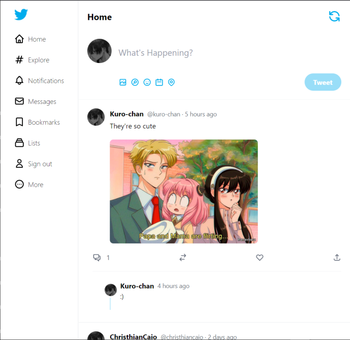

<h1 align="center"> 
    Twitter Clone 
</h1>

  <a href="#-tecnologias">Tecnologias</a>&nbsp;&nbsp;&nbsp;|&nbsp;&nbsp;&nbsp;
  <a href="#-projeto">Projeto</a>&nbsp;&nbsp;&nbsp;|&nbsp;&nbsp;&nbsp;

 

  

 

  

 

  

 

  

 

## 🚀 Tecnologias
Esse projeto foi desenvolvido com as seguintes tecnologias:
- TypeScript
- Tailwind
- Next.js
- Sanity CMS
- Next-Auth
- SRR

## 💻 Projeto
Clone do twitter 100% responsivo com as funcionalidades de Tweet, Comment, Botão de refresh, login, adicionar imagem no tweet.

## Como rodar na sua máquina
Use os seguintes comandos
- yarn;
- Abra uma nova bash e escreva cd sanity e quando estiver no diretório do sanity escreva sanity start no terminal;
- Após isso em outro terminal rode yarn dev;